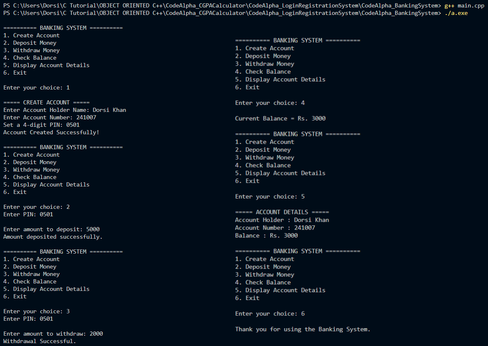

# CodeAlpha Banking System
A simple Banking System developed in C++ as part of the **CodeAlpha C++ Programming Internship**.

## Features
* Create a bank account
* Set a secure 4-digit PIN while creating an account
* PIN verification for deposit, withdrawal, balance inquiry, and account details
* Deposit money with input validation
* Withdraw money with insufficient balance checking
* Check current account balance
* Display account details
* Store account information permanently using file handling
* User-friendly menu-driven interface

## Technologies Used
* C++
* Object-Oriented Programming (OOP)
* File Handling
* Visual Studio Code
* GCC Compiler

## Sample Output



## Project Structure
```text
CodeAlpha_BankingSystem
│
├── main.cpp
├── account.txt
├── README.md
└── screenshots
    └── output.png
```

## Author
**Dorsi Khan**

B.Tech CSE (1st Year)

Central University of Punjab, Bathinda

## Internship
**CodeAlpha C++ Programming Internship**
